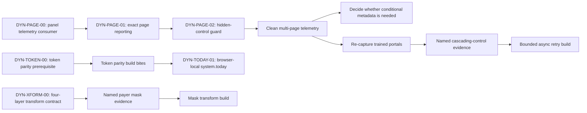

# DYNVAL spike — dynamic values and the structured-control gaps

**Status:** decision-ready findings; **no product code or schema change in this
PR**. Build bites remain separately approvable.  
**Date:** 2026-09-03 · **Branch:** `claude/dynamic-values-healthcare-9o0yod`  
**Source:** PM enhancement list, “Dynamic values / radio options / drift traps”  
**Repos read:** `sonny303/mintedpanel` @ this branch;
`sonny303/minted-extension` @ `a51fd71`  
**Hosted evidence:** author-read snapshot from project
`fkvuhfsqcmujywzgczmc`; this supervisory pass could not re-run it because the
Supabase MCP was unauthenticated.

Companion:
[`E6.10-structured-control-autofill.md`](../redesign/E6.10-structured-control-autofill.md) ·
[`E6.11-payer-pdf-field-mapping.md`](../redesign/E6.11-payer-pdf-field-mapping.md) ·
[`train-dual-registry-spike.md`](./train-dual-registry-spike.md)

---

## Verdict

The original enhancement list stays intact as the product trace, but it is not
a safe linear build queue. Engineering dependencies decide execution order.

The highest-confidence current defect is page-blind web fill: a multi-page
portal attempts portal-wide mappings on each page and reports off-page fields
with the exact reason the panel calls drift. The diagnosis is code-proven; the
original draft’s exact percentage is withdrawn because its denominators do not
reconcile.

Dynamic date values are feasible, but `system.today` must not be added until a
separate token-parity prerequisite defines why the PDF trainer offers tokens
the real PDF fill cannot resolve. The v1 token is today only, evaluated in the
coordinator’s browser-local calendar at fill time, with identical semantics on
web and PDF.

Three requested capabilities need no build: structured value/label matching,
incremental multi-page capture, and non-destructive re-capture already shipped
in E6.9/E6.10. Conditional fields, custom widgets, and bot pacing are reduced
or deferred until clean evidence exists.

---

## Locked decisions (PM, 2026-09-03)

| ID        | Decision                                                                                         | Consequence                                                                                   |
| --------- | ------------------------------------------------------------------------------------------------ | --------------------------------------------------------------------------------------------- |
| D-DYN-1   | Organize work by engineering dependencies and requirements                                       | Preserve original list numbering, but do not force it into implementation order              |
| D-DYN-2   | `system.today` means the coordinator’s browser-local calendar date                               | Never resolve it from server UTC; compute once at the fill action                             |
| D-DYN-3   | An offered token has the same meaning on an online portal and payer PDF                           | No surface may advertise a token its real fill path cannot resolve                            |
| D-DYN-4   | Full token parity is a separate prerequisite, not hidden inside the dynamic-date build            | Complete DYN-TOKEN-00 before exposing `system.today`                                           |
| D-DYN-5   | Dynamic-date v1 is today only                                                                     | No offsets, formulas, future-date syntax, or `case.*` family                                  |
| Existing  | Extension never submits payer forms                                                               | Fill and report only; the human reviews and submits                                            |
| Existing  | Token keys stay bare and literal                                                                  | No `@system.today(+30d)` mini-language at the field-map join                                   |

There are no unresolved PM questions in this spike. `phone_digits` and
`uppercase` are treated as dormant legacy constraint allowances, not an
instruction to implement them.

---

## Dependency map



Page-signal repair and the token-parity prerequisite are independent and may
run in parallel. Conditional-field work depends on clean page telemetry.
`system.today` depends on token parity. Mask transforms depend on the four-layer
contract, not on dynamic dates.

---

## Next-agent packet

```text
Mandate: build ONE approved DYN bite, not the whole register.
Bind: .cursor/skills/minted-3m-audit/ and both repos' architecture rules.

Locked:
- sequence by dependency (D-DYN-1)
- system.today = coordinator browser-local date at fill time (D-DYN-2)
- every offered token means the same thing on web and PDF (D-DYN-3)
- token parity is its own prerequisite (D-DYN-4)
- today only; no offsets, formulas, case.* or quick-card expansion (D-DYN-5)
- extension never submits; capture remains shape-only
- panel-first for the fields_skipped telemetry convention

First tranche:
1. DYN-PAGE-00 panel consumer
2. DYN-PAGE-01 extension exact-page reporting
3. DYN-PAGE-02 extension visibility guard
4. DYN-TOKEN-00 parity prerequisite (parallel)

Stop:
- ambiguous Page N attribution stays on current behavior; do not guess
- no conditional column before post-page-fix evidence
- no custom widgets or bot pacing without a named payer failure
- no transform change in one repo only
- source-grep is a tripwire, not behavioral coverage
- draft PRs only; never self-merge
```

---

## Evidence standard

### Code-verified paths

| Finding                         | Evidence                                                                                                                                                             |
| ------------------------------- | -------------------------------------------------------------------------------------------------------------------------------------------------------------------- |
| Portal-wide map fetch           | extension `src/background/api.ts` `getPortalFieldMaps(portalKey)` has no page filter                                                                                  |
| Page-blind planning             | extension `src/background/fill.ts` `planFill` filters map type/status/source/value, never `pageStep`                                                                  |
| Exact drift reason              | extension `src/content/fillEngine.ts` emits `field not found on this page`; panel `src/lib/formDrift.ts` counts that reason only when `kind === "skipped"`             |
| Blanket live-fill kind          | extension `src/background/fill.ts` stamps every content-script skip as `kind: "skipped"`                                                                              |
| Workbench duplicates predicate  | extension `src/shared/fixit.ts` counts the reason string and ignores kind; a new off-page reason must differ                                                          |
| Page metadata already exists    | extension `src/shared/apiTypes.ts` carries `PortalFieldMap.pageStep`; panel `src/services/portalFieldMaps.ts` selects `page_step`                                      |
| Capture checks visibility       | extension `src/content/captureScan.ts` `isCapturableControl`                                                                                                         |
| Fill does not check visibility  | extension `src/content/fillEngine.ts` `resolveTarget` uses selectors without a visibility guard                                                                       |
| Panel historical inference risk | panel `src/lib/formDrift.ts` `lastWorkingAt` treats “not reported broken” as worked when any field landed; a new off-page kind would otherwise become false success    |
| PDF resolver is narrower        | panel `src/routes/cases.$id.tsx` → `buildProviderTokenValues`; `src/lib/pdfFill.ts` resolves provider/group/facility only                                              |
| Sample fill masks missing data  | `src/components/templates/PayerFormFieldPanel.tsx` uses `mockValueForToken`, which returns a value for tokens the real PDF case resolver cannot supply                 |
| Transform contract has 4 layers | DB CHECK; panel UI/RPC and `applyRegistryTransform`; extension `applyTransform`                                                                                       |

### Hosted snapshot: directional only

The original pass reported:

- 35 non-test fills from 2026-08-13 through 2026-08-31;
- 490 `field not found on this page` entries, all attributed to the one
  nine-page portal (`aetna_direct`);
- zero such entries on the two listed single-page web portals;
- 95 of 161 structured rows without captured vocabulary;
- 246 of 470 field maps still proposed.

Those exact values were not independently re-run here. More importantly, the
draft mixed denominators:

- the portal table’s `fields filled` values total 545, not the stated 577;
- the listed skip-reason values total 719, while the commit message used a
  denominator of 613;
- test, manual, and content-script skips were not separated clearly.

The exact “~80% noise” claim is therefore removed. The architecture finding
does not depend on that ratio: page-blind planning and the drift predicate form
a complete code path, and the reported portal split is consistent with it.

### PHI-safe reproduction queries

Re-run before using exact counts in a build PR. These return aggregate shape
and reasons only—never provider values or response bodies.

```sql
WITH real_fills AS (
  SELECT id, portal_key, fields_filled
  FROM public.fill_sessions
  WHERE is_test = false
    AND started_at >= timestamptz '2026-08-13 00:00:00+00'
    AND started_at < timestamptz '2026-09-01 00:00:00+00'
)
SELECT
  portal_key,
  count(*) AS fills,
  sum(fields_filled) AS fields_filled
FROM real_fills
GROUP BY portal_key
ORDER BY portal_key;

WITH real_fills AS (
  SELECT
    portal_key,
    CASE
      WHEN jsonb_typeof(fields_skipped) = 'array' THEN fields_skipped
      ELSE '[]'::jsonb
    END AS fields_skipped
  FROM public.fill_sessions
  WHERE is_test = false
    AND started_at >= timestamptz '2026-08-13 00:00:00+00'
    AND started_at < timestamptz '2026-09-01 00:00:00+00'
),
skips AS (
  SELECT
    portal_key,
    coalesce(entry->>'kind', 'skipped') AS kind,
    entry->>'reason' AS reason
  FROM real_fills
  CROSS JOIN LATERAL jsonb_array_elements(fields_skipped) AS entry
)
SELECT portal_key, kind, reason, count(*) AS events
FROM skips
GROUP BY portal_key, kind, reason
ORDER BY portal_key, events DESC;

SELECT
  portal_key,
  count(DISTINCT page_step) FILTER (WHERE page_step IS NOT NULL) AS named_pages,
  count(*) FILTER (
    WHERE map_type = 'web' AND status = 'approved'
  ) AS approved_web_maps
FROM public.portal_field_maps
GROUP BY portal_key
ORDER BY portal_key;
```

### Not verified

- No live authenticated payer portal was opened. DOM behavior is code-inferred.
- `page_step` fidelity is not guaranteed. Capture names pages, but the registry
  grain is `(portal_key, selector)`, not `(portal_key, page_step, selector)`;
  a selector reused across steps has one row whose presentation metadata can be
  refreshed by the later capture.
- Production capture currently passes no heading to its page-identity helper.
  URL tail is the useful live signal; `Page N` is a fallback label, not a
  fill-time identity.
- Hosted counts above remain unverified until the aggregate queries are re-run.

---

## Original enhancement list disposition

The table keeps the source list order. “Depends on” controls build order.

| #  | Enhancement                                      | Current verdict                                                            | Rec      | Depends on                         | Effort |
| -- | ------------------------------------------------ | -------------------------------------------------------------------------- | -------- | ---------------------------------- | ------ |
| 1  | Dynamic values (`system.today`)                  | Valid; v1 is browser-local today on web and PDF                             | fix      | DYN-TOKEN-00 + parity build        | M      |
| 2a | Radio/select value↔label mismatch                | Shipped in E6.10                                                            | monitor  | Ops re-capture                     | —      |
| 2b | Cascading / asynchronously loaded options        | Mechanism gap confirmed; prevalence unmeasured                              | postpone | Named payer fixture after re-capture | M   |
| 2c | Div-based / shadow-DOM controls                  | Explicit E6.10 non-goal; widget-library-specific automation                 | postpone | Named required payer failure       | L      |
| 3  | Conditional fields create false drift           | Plausible but currently inseparable from off-page noise                     | postpone | DYN-PAGE-00..02 + clean telemetry  | M      |
| 4  | Input masks (phone, TIN, ZIP)                    | Real class; transform contract is already uneven                            | monitor  | DYN-XFORM-00 + named mask failure  | M      |
| 5  | Multi-step wizards                               | Capture shipped; fill-side page awareness is discovered Gap 0               | fix      | DYN-PAGE-00..02                    | S+S+S  |
| 6  | Auth timeout / 2FA / CAPTCHA                     | Auth/preflight/manual-submit posture shipped; bot pacing has no evidence     | monitor  | First observed portal block        | —      |
| 7  | Re-capture must preserve decisions               | Shipped in E6.9/E6.10                                                       | monitor  | None                               | —      |
| 0  | Page-blind fill → false drift (discovered)       | Code-proven trust defect on multi-page portals                              | fix      | Panel consumer before extension producer | S+S+S |

---

## Gap 0 — page-blind fill and false drift

### What is correct

The extension fetches and plans all approved web maps for a portal. The content
script attempts them on the current page. A selector absent because it belongs
to another page receives the same reason as a genuinely broken selector.

Capture is page-aware and visibility-aware; fill is neither. That is Mura in
the architecture and Muri for the coordinator: training more pages can create
more false repair work. Hidden inactive panels are the higher-risk sibling:
`querySelector` can resolve and write a hidden control, count it as filled, and
tell nobody.

### Corrections to the first proposal

1. **Not extension-only.** `fields_skipped` is a locked telemetry convention.
   The panel must understand the new off-page state first, and
   `lastWorkingAt` must treat it as “no evidence,” not “worked.”
2. **Do not call `derivePageStep` at fill time.** That helper names a captured
   page using a collision set. Fill needs to match the current page to existing
   page buckets.
3. **Heading is unavailable today.** Production capture passes `null`; the
   first safe matcher is exact URL-tail ↔ existing `pageStep`.
4. **Do not score ambiguous buckets in v1.** Selector-overlap scoring can pick
   a hidden panel or hide genuine drift. When no exact identity exists, retain
   current behavior and report ordinary not-found.
5. **Use a distinct reason and kind.** Panel drift keys on reason+kind, while
   the extension Fix-it strip keys on reason alone.
6. **Carry `pageStep` to the content script.** `FillInstruction` does not
   include it today, and background logging currently overwrites every content
   skip with `kind: "skipped"`.

### Selected behavior

- Keep portal-wide planning so pre-fill coverage retains one stable
  denominator.
- At apply time, use exact URL-page identity when available.
- Return off-page instructions as a visible, non-drift report with a new
  reason and `kind: "other_page"`; do not write them.
- Keep on-page unresolved selectors as the existing drift reason.
- If page identity is ambiguous (`Page N`, shared URL, reused selector), do not
  guess: preserve current not-found behavior.
- Reject hidden controls before writing and report a separate non-drift reason.

Old extension + new panel remains current behavior. New extension should not
ship before the panel consumer because otherwise off-page rows may become a
false `lastWorkingAt` success.

Rejected: a panel-only heuristic. `fields_filled` is a count, not the list of
maps that landed, so the panel cannot infer which page was present.

---

## Gap 1 — dynamic values and the token-parity prerequisite

### Existing capability mismatch

The web and PDF trainers share `useTokenCatalog()`, but their real resolvers do
not share a capability contract.

| Token family                        | Mapping picker | Web profile/fill                                      | Real payer-PDF fill |
| ----------------------------------- | -------------- | ----------------------------------------------------- | ------------------- |
| `provider.*`, `group.*`, `facility.*` | offered      | resolved                                              | resolved            |
| `license.*`                         | offered        | resolved by requested case state                      | missing             |
| `assignment.*`                      | offered        | resolved by selected facility                         | missing             |
| `groupInsurance.*`                  | offered        | resolved by policy selection                          | missing             |
| `user.*`                            | offered        | resolved from caller profile/auth                     | missing             |
| `payer.*`, `mso.*`, `contract.*`    | offered        | deliberately returned null: profile route has no case | missing             |
| org-contact families                | not in mapping picker | appended to web profile/quick-card surfaces      | missing             |
| `system.today`                      | not yet offered | not yet resolved                                      | not yet resolved    |

`PayerFormFieldPanel` makes this harder to detect: its sample fill uses
`mockValueForToken`, which returns a non-empty synthetic value for essentially
any token. The comment that a token resolving in the sample also resolves in a
real case is false. `user.*` is one confirmed example, not the whole gap.

D-DYN-3 rejects adding another token to this mismatch. DYN-TOKEN-00 is a
separate prerequisite because solving all existing family/data-source choices
inside `system.today` would turn a small feature into an unreviewable platform
change.

### `system.today` v1 semantics

- Bare key: `system.today`.
- Value: local calendar `YYYY-MM-DD`.
- Clock: the coordinator’s browser at the moment Fill is clicked.
- Web: extension runtime supplies it to planning; server UTC does not.
- PDF: panel browser supplies it at fill click, not case-page load.
- Formatting: existing `date_mmddyyyy` may produce `MM/DD/YYYY`.
- Same machine and action date produce the same value on both surfaces.
- No profile API change, org timezone column, persisted value, or cache.
- No quick-card field: this is a mapping-time value, not provider reference
  data.

Compute once in orchestration and pass the ISO date into pure planners. Pure
libraries do not read the clock, keeping boundary tests deterministic.

### Explicitly out

- `@system.today(+30d)` or any offset parser;
- arbitrary formulas;
- future requested-effective-date helpers;
- `case.*` tokens;
- server UTC or a new org timezone setting;
- adding `system.today` before token-parity acceptance criteria pass.

---

## Gaps 2, 5, and 7 — shipped versus residual

### 2a — value/label mismatch: shipped

E6.10 is present in both repos:

- capture records `{ value, label }` option vocabularies without selected
  values;
- re-capture refreshes non-empty vocabulary without erasing decisions;
- select/radio fill matches exact value, normalized label, then normalized
  value;
- mismatches name the control and show a bounded option sample;
- the registry renders control type and the “no captured options—re-capture”
  guidance (`FieldRegistryList.tsx`).

The reported 95/161 missing vocabularies and 246 proposed rows are an
operations inventory, not missing mechanism. Re-capture and decide the three
trained portals after page telemetry is clean; do not build another mapper.

### 5 — multi-step wizard: capture shipped, fill remains Gap 0

`page_step`, incremental page merge, presentation refresh, and registry
grouping already ship. The missing half is safe page-aware fill reporting.

One constraint remains: field-map uniqueness is per `(portal_key, selector)`,
not page. A control selector reused on two steps cannot carry two independent
page identities. Do not widen that grain inside DYN-PAGE; log a named collision
before proposing schema work.

### 7 — non-destructive re-capture: shipped

Re-capture updates presentation (`sort_order`, raw label/section, `page_step`,
non-empty `control_options`) and preserves decision fields (`status`, `token`,
`source`, fixed value, notes, admin display/grouping). Removed fields surface
as drift instead of being deleted. Monitor; no build.

---

## Gap 2b — cascading / asynchronously loaded options

The mechanism gap is real: extension `applyFill` is synchronous. A parent
selection can trigger an AJAX child list after the loop has already attempted
the child.

Do not add a fixed sleep. A build requires a named payer fixture and must:

1. preserve instruction ordering;
2. make content-message completion genuinely asynchronous;
3. wait with a bounded `MutationObserver` or equivalent signal after a
   select/radio change;
4. retry unresolved dependent controls once;
5. report honestly after the bound expires.

The original snapshot reported only 15 vocabulary mismatches against much
larger page noise. Re-capture and page repair come first; prevalence is
otherwise unknown.

---

## Gap 2c — div-based and shadow-DOM controls

This remains an E6.10 non-goal. `Fillable` is native input/select/textarea.
ARIA-role widgets require library-specific pointer and keyboard behavior;
shadow DOM additionally changes scanning and injection boundaries.

Recommendation: postpone, not a generic “support custom controls” epic. Reopen
only for a named required payer, exact widget library, DOM fixture, and manual
fallback cost.

---

## Gap 3 — conditional fields

The value-present case is plausible: a mapped field on a branch the provider
does not take is absent and currently looks broken. The value-empty case
already reports `no_value`, not drift.

The first draft’s nullable Boolean is **not yet a correct solution**:

- it is a trainer assertion, not detection;
- it suppresses genuine selector drift whenever that condition is active;
- panel `lastWorkingAt` could still infer success from an unrelated field;
- current off-page noise prevents measuring the remaining population.

After DYN-PAGE and a fresh telemetry sample, either close this item with no
code or write a separate presence-policy spike. No migration is approved by
this document.

---

## Gap 4 — input masks and transform drift

Input/change-driven mask libraries may already reformat `setNativeValue`;
keydown/beforeinput-driven masks may not. A named portal fixture must decide
which failure exists.

Before adding a transform, reconcile four sources:

| Layer                       | Current behavior                                                                              |
| --------------------------- | --------------------------------------------------------------------------------------------- |
| Baseline DB CHECK           | allows `date_mmddyyyy`, `state_abbrev`, `phone_digits`, `uppercase`                           |
| Panel UI + both writers     | allow `date_mmddyyyy`, `state_abbrev` only                                                     |
| Extension web fill          | implements those two; unknown values pass through raw; full state names are abbreviated       |
| Panel PDF fill              | implements those two; unknown values pass through raw; `state_abbrev` only uppercases 2 letters |

The E6.10 migration explicitly chose the two authorable transforms, so the
extra baseline values are dormant allowance, not a feature requirement. Do not
implement them speculatively and do not change the constraint in isolation.

E6.11 B8 already owns future value-shaping expansion. DYN-XFORM-00 supplies its
precondition: one named semantic per stored string, parity tests across DB/RPC,
panel PDF, and extension, and a panel-first coordinated release.

---

## Gap 6 — auth, 2FA, CAPTCHA, and pacing

Already shipped:

- URL recognition by longest origin/path prefix;
- content-script preflight before PHI-bearing instructions;
- clear session-expired/reload paths;
- human handling of login and 2FA;
- manual submit only.

No verified telemetry shows a payer blocking automation for speed. The original
unsupported-tab image citation does not exist in either inspected tree, so it
is removed; behavior is cited from code instead.

Do not slow every fill preemptively. Monitor actual session/auth failures and
open a payer-specific bite on the first confirmed block.

---

## 3M register (current)

| ID               | 3M   | Area                 | Finding                                                        | Sev | Effort | Cadence    | Rec      | Why it still hurts                                      |
| ---------------- | ---- | -------------------- | -------------------------------------------------------------- | --- | ------ | ---------- | -------- | ------------------------------------------------------- |
| DYN-PAGE-SIGNAL  | Muri | Work / drift         | Off-page maps become false broken selectors                    | S1  | S+S    | daily      | fix      | Repair badges and payer funnel lose trust               |
| DYN-PAGE-HIDDEN  | Muri | Work fill            | Hidden resolved controls can be written and counted            | S1  | S      | daily      | fix      | Wrong-page data can land silently                       |
| DYN-TOKEN-PARITY | Mura | Web + PDF mapping    | One picker advertises unequal runtime capabilities             | S1  | L      | daily      | A trained PDF can prove green, then fill blank          |
| DYN-TODAY        | Mura | Signature/date boxes | No browser-local runtime date token                             | S2  | M      | daily      | Coordinator retypes a predictable value                 |
| DYN-RECAPTURE    | Muda | Trained catalog      | Older rows lack vocabulary or remain undecided                 | S2  | ops    | once-payer | ops      | Existing capability is not converted into coverage      |
| DYN-XFORM        | Mura | Transform contract   | DB, writers, web and PDF disagree                              | S2  | M      | setup      | Unknown strings silently fill raw                       |
| DYN-ASYNC        | Muri | Cascading controls   | Synchronous loop cannot wait for dependent options             | S2  | M      | daily      | Affected portals require manual correction              |
| DYN-CONDITIONAL  | Muda | Drift                | Conditional absence is not distinguishable after page noise    | S2  | M      | daily      | Building now may suppress real defects                  |
| DYN-CUSTOM       | Muri | Custom widgets       | Generic support would be widget-library-specific automation    | S3  | L      | rare       | Broad build creates fragile maintenance burden          |
| DYN-AUTH-PACING  | Muda | Portal access        | Bot pacing proposal has no observed failure                    | S3  | —      | rare       | Slowing all fills creates work without evidence         |
| DYN-CLOSED       | Muda | Backlog              | Items 2a, 5 capture, and 7 describe shipped behavior           | S3  | —      | setup      | Rebuilding them spends effort without user value        |

---

## Untangled build slices

### BITE-DYN-PAGE-00 — make the panel an honest telemetry consumer

- **3M:** Muri
- **Cadence:** daily
- **Repos:** panel
- **Depends on:** none
- **Objective:** accept off-page telemetry without creating drift or false
  “last worked” evidence.
- **Files/areas:** `src/lib/formDrift.ts`, `src/lib/formDrift.test.ts`.
- **Table/wire trace:** reads `fill_sessions.fields_skipped`; no DB write,
  schema, route, or PHI payload change.
- **Steps:**
  1. Pin the off-page kind and reason as the additive producer contract.
  2. Keep `brokenMapsForFill` limited to genuine on-page not-found.
  3. Make `lastWorkingAt` treat off-page as no evidence and continue backward.
- **Verification:** unit fixtures for drift, `lastWorkingAt`, legacy entries,
  and malformed jsonb; static panel gates.
- **Rollback:** revert the panel PR; old extension telemetry is unchanged.
- **Definition of done:**
  - off-page is not drift;
  - off-page is not inferred success;
  - legacy not-found remains drift.
- **Non-goals:** extension page detection, UI redesign, schema.
- **PM decision needed:** none.

### BITE-DYN-PAGE-01 — report exact off-page fields without guessing

- **3M:** Mura + Muri
- **Cadence:** daily
- **Repos:** extension
- **Depends on:** BITE-DYN-PAGE-00 deployed
- **Objective:** distinguish exact URL-page misses from broken on-page
  selectors while preserving portal-wide coverage.
- **Files/areas:** `src/shared/fill.ts`, `src/background/fill.ts`,
  `src/content/fillEngine.ts`, page-matching helper + tests,
  `src/shared/fixit.ts`.
- **Table/wire trace:** reads existing `PortalFieldMap.pageStep`; posts an
  additive kind/reason inside `fill_sessions.fields_skipped`; no endpoint or
  schema change.
- **Steps:**
  1. Carry nullable `pageStep` on each `FillInstruction`.
  2. Match URL tail to an existing page bucket.
  3. Do not apply exact other-page instructions; return the pinned reason/kind.
  4. Preserve ordinary not-found when identity is null or ambiguous.
  5. Stop blanket-overwriting all content skips as `kind: "skipped"`.
- **Verification:** behavioral unit tests for single-page/null, exact two-page,
  ambiguous `Page N`, reused selector, and extension drift-strip counts.
- **Rollback:** revert extension PR; panel remains backward-compatible.
- **Definition of done:**
  - exact off-page fields remain visible but never count as drift;
  - on-page missing fields still count;
  - pre-fill coverage denominator is unchanged;
  - ambiguous pages behave exactly as before.
- **Non-goals:** selector-overlap scoring, heading capture, per-page coverage,
  conditional metadata.
- **PM decision needed:** none.

### BITE-DYN-PAGE-02 — never write hidden controls

- **3M:** Muri
- **Cadence:** daily
- **Repos:** extension
- **Depends on:** BITE-DYN-PAGE-01
- **Objective:** prevent writes into inactive wizard panels.
- **Files/areas:** shared visibility predicate from
  `src/content/captureScan.ts`, `src/content/fillEngine.ts`, DOM tests.
- **Table/wire trace:** no database or panel API change; emits a distinct
  non-drift skip reason.
- **Steps:** share the capture visibility rule, check before native value
  mutation, and report hidden targets rather than counting them filled.
- **Verification:** DOM fixture with visible and hidden duplicate panels;
  assert hidden value unchanged and filled count honest.
- **Rollback:** revert extension PR.
- **Definition of done:** no hidden target is mutated; visible fill behavior is
  unchanged; hidden skips are not drift.
- **Non-goals:** custom widgets, shadow DOM, animation timing.
- **PM decision needed:** none.

### BITE-DYN-TOKEN-00 — token-parity prerequisite

- **3M:** Mura
- **Cadence:** daily
- **Repos:** panel + extension (spike; coordinated build map)
- **Depends on:** none; may run parallel to DYN-PAGE
- **Objective:** define and measure one honest field-map token promise before
  adding `system.today`.
- **Files/areas:** panel token catalog, provider profile, PDF token builder,
  sample fill; extension planner and API types; aggregate hosted usage.
- **Table/wire trace:** read-only aggregate of
  `portal_field_maps(map_type,status,source,token)`; no values or PHI.
- **Steps:**
  1. Inventory approved mapped-token use by family and map type.
  2. Pin which families both web and PDF must resolve.
  3. Choose source acquisition under existing browser-RLS/API boundaries.
  4. Split implementation into resolver, orchestration, and behavioral-test
     bites; identify whether any locked API contract must widen.
- **Verification:** capability matrix reconstructed from code plus aggregate
  usage query; builder prompts each stay within bite-size rules.
- **Rollback:** docs/test-contract revert; no data mutation.
- **Definition of done:** every offered family has a named source on both
  paths, unsupported existing mappings have a migration/UX posture, and the
  sample fill cannot claim support the case fill lacks.
- **Non-goals:** implementing parity, adding `system.today`, `case.*`, or a
  frontend exception to call the PHI profile API.
- **PM decision needed:** none; D-DYN-3/4 already lock the outcome and scope.

### BITE-DYN-TODAY-01 — browser-local today on web and PDF

- **3M:** Mura + Muda
- **Cadence:** daily
- **Repos:** panel + extension
- **Depends on:** DYN-TOKEN-00 and its approved parity build bites
- **Objective:** fill signature/application date with the coordinator’s local
  date on both surfaces.
- **Files/areas:** panel `src/services/tokenCatalog.ts`, real PDF fill
  orchestration/planner tests; extension `src/background/fill.ts` planner tests.
- **Table/wire trace:** stores bare `system.today` only in field maps; runtime
  value is transient and never persisted/logged.
- **Steps:** add catalog metadata, compute one local ISO date at fill click,
  inject it into each pure planner, and verify existing date transform.
- **Verification:** local date-boundary tests, cross-path equality, PDF
  fill-click freshness, web/PDF transformed output, no value in telemetry.
- **Rollback:** retire mappings before reverting producer code if any were
  trained; otherwise revert coordinated PRs.
- **Definition of done:** one key, one ISO value, both surfaces, today only.
- **Non-goals:** offsets, formulas, `case.*`, org timezone, server UTC, quick
  cards.
- **PM decision needed:** none.

### BITE-DYN-XFORM-00 — close the transform contract before masks

- **3M:** Mura
- **Cadence:** setup
- **Repos:** panel + extension
- **Depends on:** named E6.11 B8/mask requirement
- **Objective:** make every stored transform string mean the same thing in all
  four layers.
- **Files/areas:** new additive migration only if the allowed set changes,
  `src/lib/controlOptions.ts`, `src/services/portalFieldMaps.ts`,
  `src/lib/payerFormFill.ts`, extension `src/background/fill.ts`, tests.
- **Table/wire trace:** `portal_field_maps.transform`; no new table or route.
- **Verification:** behavioral parity per transform in web and PDF; hosted
  object/row check before any constraint replacement; panel and extension CI.
- **Rollback:** revert code; additive migration remains and deprecated values
  stay unwritten.
- **Definition of done:** no authorable transform silently passes through raw;
  `state_abbrev` has one semantic; unknown values fail closed at writers.
- **Non-goals:** speculative mask formats or custom widget event synthesis.
- **PM decision needed:** exact transforms only after a named form requirement.

### BITE-DYN-ASYNC-01 — bounded retry for a named cascading control

- **3M:** Muri
- **Cadence:** daily on the affected payer
- **Repos:** extension
- **Depends on:** re-capture plus a reproducible payer fixture
- **Objective:** fill one proven parent→dependent control without fixed sleeps.
- **Files/areas:** content message handler, `fillEngine.ts`, DOM harness.
- **Verification:** fixture where selecting state asynchronously injects county;
  county fills once or reports after a bounded retry.
- **Rollback:** revert extension PR.
- **Definition of done:** message lifecycle waits correctly, one retry is
  bounded, and unrelated controls do not pause.
- **Non-goals:** dependency graph inference for arbitrary forms.
- **PM decision needed:** named payer/fixture is the entry gate.

### OPS-DYN-RECAPTURE — use the capability already shipped

- **3M:** Muda
- **Cadence:** once-payer
- **Repos:** ops
- **Depends on:** DYN-PAGE-00..02 for trustworthy follow-up telemetry
- **Objective:** refresh option vocabulary and decide proposed rows on the
  trained portals.
- **Verification:** re-run aggregate counts; E6.10 missing-vocabulary copy is
  already code-verified.
- **Rollback:** re-capture is non-destructive; decisions still require a human.
- **Definition of done:** owner records before/after counts and no existing
  decision is reset.
- **Non-goals:** agent-run hosted writes.
- **PM decision needed:** human owner/window only.

---

## Lanes

| Code                                                         | Ops                    | Separate prerequisite | Postpone / evidence gate                         |
| ------------------------------------------------------------ | ---------------------- | --------------------- | ------------------------------------------------ |
| DYN-PAGE-00, DYN-PAGE-01, DYN-PAGE-02, DYN-TODAY-01         | OPS-DYN-RECAPTURE      | DYN-TOKEN-00          | DYN-ASYNC, conditional presence, custom widgets  |
| DYN-XFORM-00 only when E6.11 B8 names exact transform needs  | Hosted aggregate re-run | —                     | CAPTCHA/pacing until first confirmed block       |

---

## Keep / Improve / Kill

**Keep**

- the original enhancement list as traceability;
- telemetry-first diagnosis, with code evidence independent of exact counts;
- portal-wide coverage and report-at-apply behavior;
- non-destructive re-capture and human submit;
- existing transforms before inventing a token expression language.

**Improve**

- panel-first telemetry semantics before extension production;
- real fill capability tests instead of synthetic sample optimism;
- one web/PDF token promise;
- transform semantics across all four layers;
- aggregate-query provenance for future priority claims.

**Kill or defer**

- rebuilding items 2a, 5 capture, or 7;
- selector-bucket guessing in the first page-aware bite;
- a conditional Boolean before clean evidence;
- generic custom-widget support;
- speculative human-speed typing/CAPTCHA pacing;
- offsets, formulas, `case.*`, and quick-card expansion in dynamic-date v1.

---

## Recommended next tranche

1. **DYN-PAGE-00** — panel consumer and historical inference.
2. **DYN-PAGE-01** — extension exact-page reporting.
3. **DYN-PAGE-02** — extension hidden-control guard.
4. **DYN-TOKEN-00** — run in parallel as the prerequisite for dynamic values.

After those close: re-run telemetry, perform the human re-capture pass, then
approve or reject the parity build bites. `DYN-TODAY-01` is first after parity.
Conditional, async, transform expansion, custom widgets, and pacing do not enter
the tranche without their stated evidence gates.

---

## Verification bar for this spike

- All cited panel paths verified on `main`/this branch.
- Extension claims verified against `a51fd71`, which was extension `main` at
  review time.
- Hosted claims explicitly separated from code-verified facts.
- No unresolved PM question remains.
- No schema, product code, hosted data, or locked wire contract changed.
- Docs-tier gates: `npm run lint`, `npx tsc --noEmit`, `npm run test`,
  `npx prettier --check .`.

---

## Revision history

- **2026-09-03, Claude:** initial findings-only spike from the PM enhancement
  list and a read-only hosted snapshot.
- **2026-09-03, supervisory 3M review:** locked D-DYN-1..5; corrected the
  evidence denominator, page-identity algorithm, panel historical-metric
  dependency, PDF token-parity scope, four-layer transform contract, and
  already-shipped items; converted recommendations into dependency-ordered
  bites with explicit evidence gates.
