# Environment & deployment architecture

Current-state map of Minted's technical environments, repositories, code
promotion paths, and runtime data flows. Application layering (Component →
hook → service → Supabase) lives in [`ARCHITECTURE.md`](../../ARCHITECTURE.md).
Release guardrails and activation status live in
[`release-contract.md`](release-contract.md),
[`staging-delivery.md`](staging-delivery.md), and
[`production-release.md`](production-release.md).

**As of this document:** hosted staging/production _control code_ exists in
repo, but **hosted delivery activation is blocked** (`HOSTED_ACTIVATION_BLOCKED`
in `scripts/delivery/boundary.mjs`). Identity below is from the reviewed G0
allowlist and live Supabase inventory — not proof that every alias/cutover has
already run through the new controller.

---

## 1. System at a glance

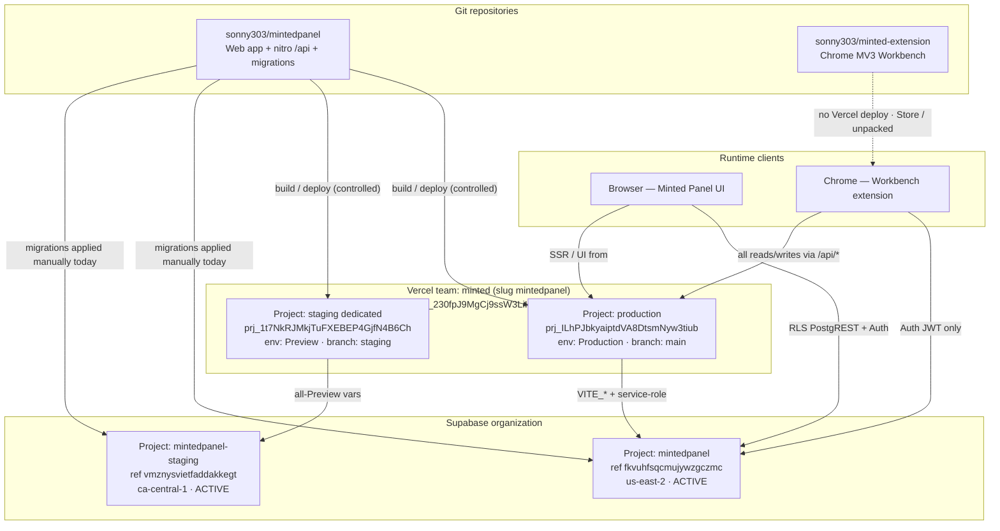

---

## 2. Repositories (separate mapping)

| Repo                                                                        | Role                                                               | Default branch | CI                                                                                     | Deploy artifact                                             |
| --------------------------------------------------------------------------- | ------------------------------------------------------------------ | -------------- | -------------------------------------------------------------------------------------- | ----------------------------------------------------------- |
| [`sonny303/mintedpanel`](https://github.com/sonny303/mintedpanel)           | Panel UI, nitro `/api/*`, Supabase migrations, release controllers | `main`         | `.github/workflows/ci.yml` (+ manual `staging-delivery.yml`, `production-release.yml`) | Vercel Build Output (TanStack Start / nitro)                |
| [`sonny303/minted-extension`](https://github.com/sonny303/minted-extension) | MV3 side panel, content scripts, fill/capture                      | `main`         | `.github/workflows/ci.yml`                                                             | Chrome packaged / unpacked build — **not** a Vercel project |

Cross-repo rule ([`repo-workflow.md`](repo-workflow.md)): **panel-first** for
`/api` wire contracts; mirror types in the extension in a coordinated follow-up.
The extension never holds the service-role key and never queries Supabase tables.

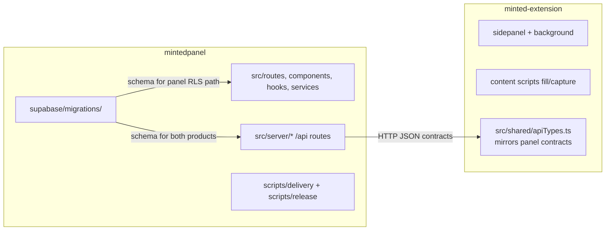

---

## 3. Environments & infrastructure inventory

### 3.1 Environment matrix

| Environment               | Git ref (intended)                                   | Vercel project                     | Vercel target                  | Supabase project                                                       | Primary URLs / aliases                                             |
| ------------------------- | ---------------------------------------------------- | ---------------------------------- | ------------------------------ | ---------------------------------------------------------------------- | ------------------------------------------------------------------ |
| **Local / cloud sandbox** | feature branch                                       | none                               | `npm run dev`                  | optional local Supabase **or** Playwright mock (`example.supabase.co`) | `http://localhost:…`                                               |
| **Staging**               | `staging` (fast-forward from admitted `main` CI SHA) | `prj_1t7NkRJMkjTuFXEBEP4GjfN4B6Ch` | Preview (all-Preview env vars) | `mintedpanel-staging` (`vmznysvietfaddakkegt`)                         | `staging.mintedpanel.com`, `mintedpanel-staging.vercel.app`        |
| **Production**            | `main`                                               | `prj_ILhPJbkyaiptdVA8DtsmNyw3tiub` | Production                     | `mintedpanel` (`fkvuhfsqcmujywzgczmc`)                                 | `mintedpanel.com`, `www.mintedpanel.com`, `mintedpanel.vercel.app` |

There is **no separate “dev” hosted Vercel/Supabase project** in the G0
allowlist. Preview URLs on the production project are not a release target
(`preview` is explicitly rejected by the release contract CLI).

### 3.2 Vercel (team `minted` / slug `mintedpanel`)

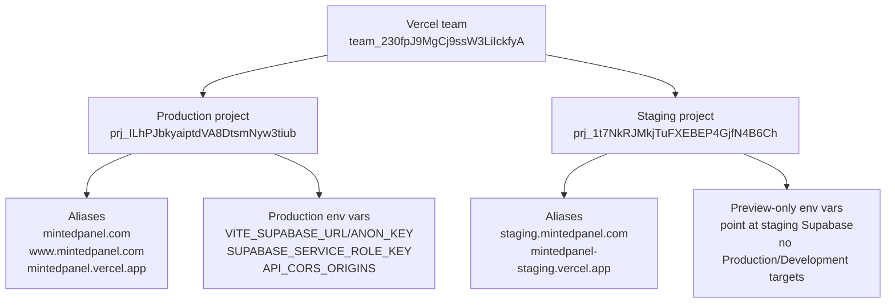

Controls that matter:

- `vercel.json` sets `git.deploymentEnabled: false` — automatic Git pushes must
  **not** publish. Intended delivery is an explicit upload/promote path under
  lease (see §4).
- Staging and production are **separate projects** so staging credentials cannot
  reach the production project by configuration inheritance.
- Staging uses **all-Preview** variable scope (no branch selector); the workflow
  is responsible for enforcing the `staging` application branch.

### 3.3 Supabase

| Project name          | Ref                    | Region       | Role                                                                   |
| --------------------- | ---------------------- | ------------ | ---------------------------------------------------------------------- |
| `mintedpanel`         | `fkvuhfsqcmujywzgczmc` | us-east-2    | Production + current demo/UAT data (pre-launch; not real patient data) |
| `mintedpanel-staging` | `vmznysvietfaddakkegt` | ca-central-1 | Isolated staging database                                              |

Both projects are `ACTIVE_HEALTHY`. Migrations live only in
`mintedpanel/supabase/migrations/` and are applied to hosted projects **manually
today** (SQL Editor / dashboard / MCP) — there is not yet an automated
`dev → staging → prod` migration pipeline
([`repo-workflow.md`](repo-workflow.md) human-only ops).

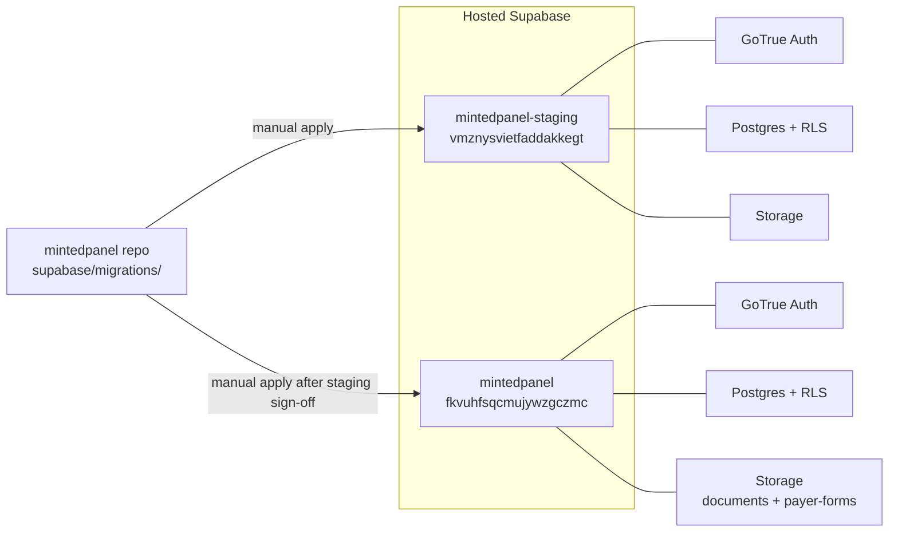

---

## 4. Code promotion paths

### 4.1 Day-to-day development (both repos)

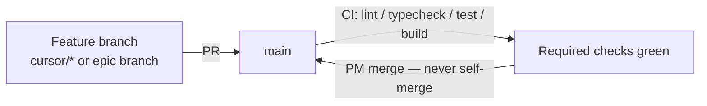

- Panel CI: format, typecheck, lint, unit tests, build, migration dry-run,
  release-contract tests (`npm run test:release`).
- Extension CI: typecheck, lint, vitest.
- Dual-repo API changes: **two PRs** (panel first, then extension).

### 4.2 Intended webapp promotion (controlled delivery)

Source of truth for identities:
`scripts/release/contract.mjs` / `scripts/delivery/boundary.mjs`.

```mermaid
flowchart TB
  PUSH["Push / merge to main"] --> CI["ci.yml on main<br/>admits exact SHA"]
  CI --> DISP_S["Manual: staging-delivery.yml<br/>inputs: ci_run_id + source_sha"]
  DISP_S --> ADMIT["Admit successful main CI<br/>fast-forward refs/heads/staging"]
  ADMIT --> LEASE_S["Acquire staging lease<br/>refs/tags/minted-delivery-lock-staging"]
  LEASE_S --> PRE["G0 staging-preflight<br/>rehearse additive migrations<br/>against matching baseline"]
  PRE --> BUILD_S["Build Preview candidate<br/>dedicated staging Vercel project"]
  BUILD_S --> MIG_S["Apply approved additive plan<br/>to vmznysvietfaddakkegt"]
  MIG_S --> ALIAS_S["Assign staging aliases<br/>secondary then staging.mintedpanel.com"]
  ALIAS_S --> QUAL["Emit staging-qualification artifact"]

  QUAL --> DISP_P["Manual: production-release.yml<br/>input: staging_run_id"]
  DISP_P --> PREP["prepare job<br/>stage qualification + historical prod baseline"]
  PREP --> APPR["GitHub Environment: Production<br/>sole reviewer sonny303"]
  APPR --> LEASE_P["Acquire production lease"]
  LEASE_P --> G0P["Full production G0<br/>fresh matching backup after approval"]
  G0P --> CAND["Build production candidate<br/>vercel deploy --prod --skip-domain"]
  CAND --> MIG_P["Apply same additive plan<br/>to fkvuhfsqcmujywzgczmc"]
  MIG_P --> PROMOTE["Promote exact candidate<br/>to production aliases"]
  PROMOTE --> POST["Postchecks + optional<br/>compatible-app-only rollback"]
```

**Status:** controller, adapters, and workflows exist in source; the hosted
entrypoint still throws `HOSTED_ACTIVATION_BLOCKED` until collectors, scoped
credentials, Git-disconnect readbacks, and recovery evidence are wired. Until
then, do not treat a green simulation test as authorization to mutate staging
or production.

### 4.3 Extension promotion (separate from web/DB)

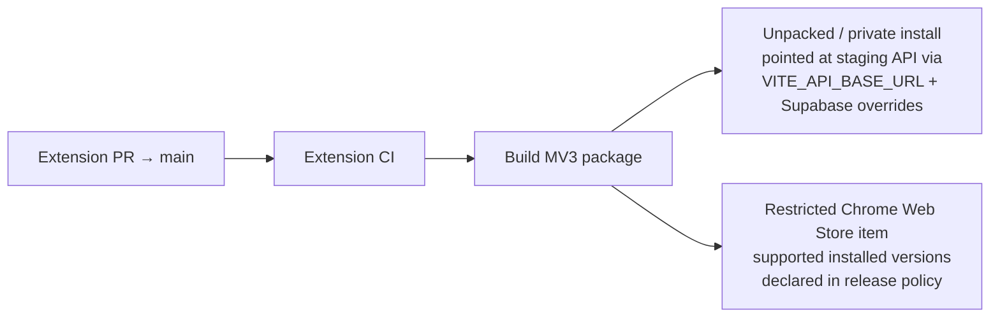

- Extension release is **not** performed by `staging-delivery.yml` /
  `production-release.yml`. Those workflows only require _compatibility proof_
  against declared installed extension versions.
- Build-time overrides (`VITE_SUPABASE_URL`, `VITE_SUPABASE_ANON_KEY`,
  `VITE_API_BASE_URL`) let an unpacked build target staging; defaults remain
  production when unset.

### 4.4 What is _not_ a promotion path

| Path                                         | Why not                                                                                            |
| -------------------------------------------- | -------------------------------------------------------------------------------------------------- |
| Auto-deploy on every `main` push             | Disabled by `vercel.json` `git.deploymentEnabled: false`                                           |
| Promote a Preview URL directly to Production | Creates a different production build; contract requires an explicit production candidate + promote |
| Extension writing to Supabase tables         | Forbidden — JWT + panel `/api` only                                                                |
| Agent self-merge to `main`                   | Governance — PM merges                                                                             |

---

## 5. Runtime data flows

### 5.1 Panel browser → Supabase (primary UI path)

Most screens use RLS under the anon key. No frontend hook calls `/api` except
document / payer-form **signing** endpoints.

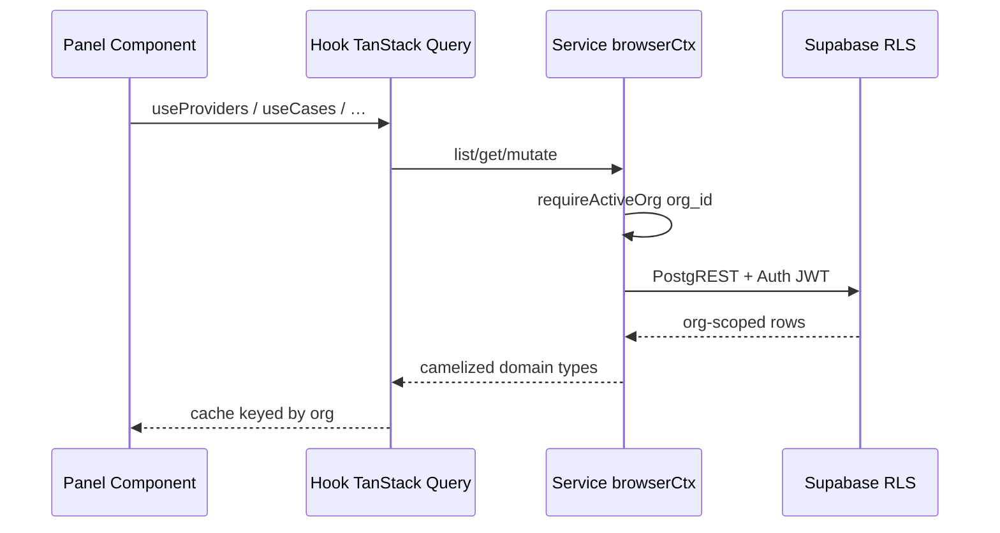

### 5.2 Extension → Panel `/api` → Supabase (Workbench path)

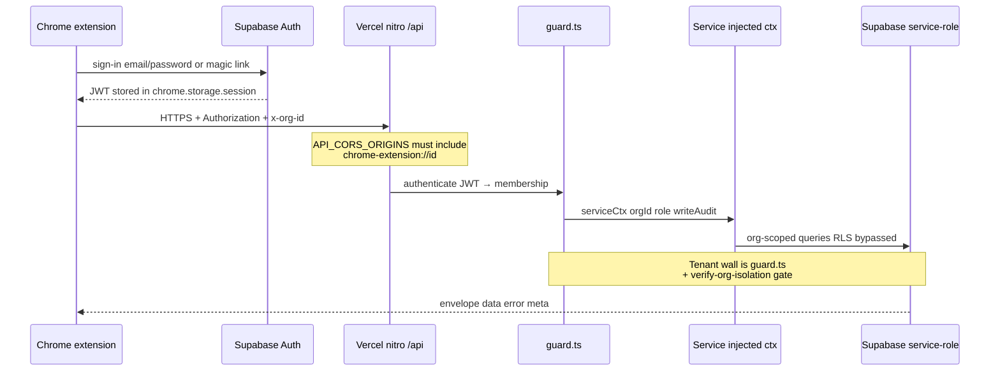

Key contracts:

- Extension **never** embeds `SUPABASE_SERVICE_ROLE_KEY`.
- PHI-dense responses (`/api/providers/:id/profile`, case context) use
  `Cache-Control: no-store` and are not logged.
- Touches body is snake_case; fill-events are camelCase — both locked.

### 5.3 Dual-path summary (one backend, two clients)

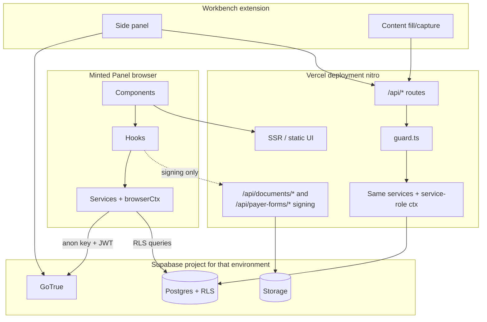

### 5.4 Auth & tenancy

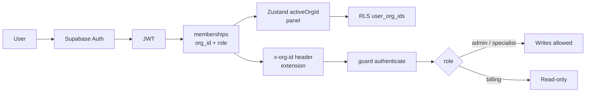

---

## 6. Secrets & config by surface

| Surface                   | Supabase URL / anon                    | Service role                | API base                | CORS                                            |
| ------------------------- | -------------------------------------- | --------------------------- | ----------------------- | ----------------------------------------------- |
| Panel browser             | `VITE_SUPABASE_*`                      | never                       | same origin             | n/a                                             |
| Panel nitro `/api`        | `SUPABASE_URL` (or Vite URL on server) | `SUPABASE_SERVICE_ROLE_KEY` | self                    | `API_CORS_ORIGINS` incl. `chrome-extension://…` |
| Extension (prod default)  | baked / `VITE_SUPABASE_*`              | never                       | production panel origin | must be allowlisted on panel                    |
| Extension (staging build) | override env at build                  | never                       | staging panel origin    | staging project CORS                            |
| Local e2e (cloud)         | `https://example.supabase.co` mock     | n/a                         | mock harness            | n/a                                             |

---

## 7. Related documents

| Doc                                              | Use when                                  |
| ------------------------------------------------ | ----------------------------------------- |
| [`ARCHITECTURE.md`](../../ARCHITECTURE.md)       | In-process layering and `/api` DI         |
| [`repo-workflow.md`](repo-workflow.md)           | Who merges what; human-only ops           |
| [`release-contract.md`](release-contract.md)     | G0 identity allowlist and validation      |
| [`staging-delivery.md`](staging-delivery.md)     | Staging controller status and blockers    |
| [`production-release.md`](production-release.md) | Production approval / promote sequence    |
| [`release-controls.md`](release-controls.md)     | Git freeze, GitHub Production environment |
| Extension `CLAUDE.md`                            | Workbench wire contracts (sibling repo)   |

---

## Keep this file honest

When environments, project IDs, aliases, or activation status change, update
this document in the same PR as the allowlist / boundary change. Prefer current
facts over aspirational pipelines; mark blocked paths explicitly.
