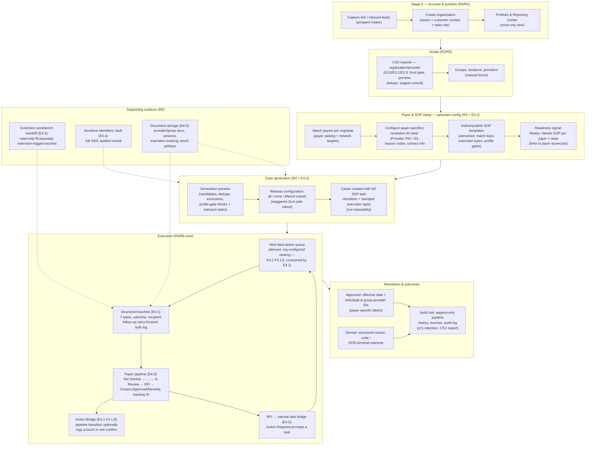
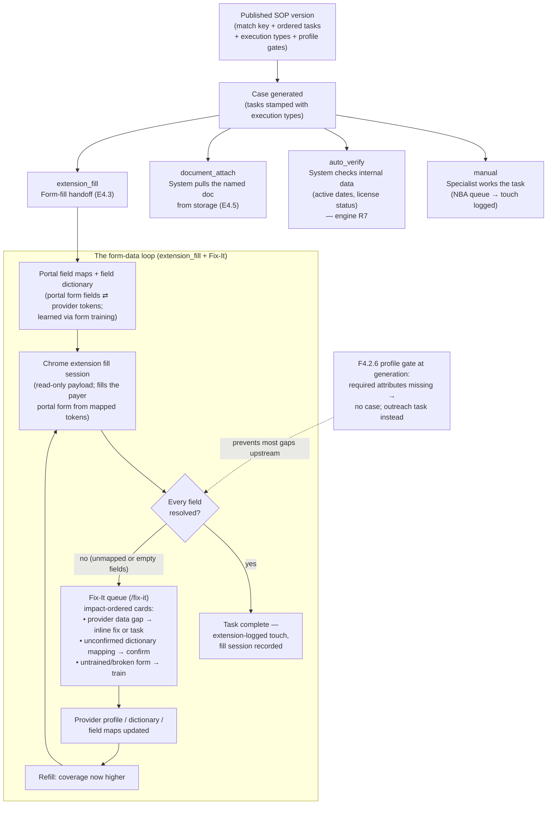

# End-to-End Workflow Through R6

PM reference (2026-07-14). Not an epic — a map of how the shipped stages
(R0–R5) and the R6 epics compose into one operating workflow, plus the
step-by-step payer & SOP setup flow. Cited features link to their epics.

## The full workflow (R0 → R6)

Key structural rules the diagram encodes:

- **Upstream determinism (A0):** payer & SOP setup happens BEFORE cases
  exist; generated cases arrive fully specified — specialists execute, never
  investigate.
- **Two parallel state tracks:** internal credentialing status (existing,
  untouched) and the payer-facing pipeline (E4.0). Touches (effort) and
  pipeline history (status) are decoupled events, joined at the UI by the
  Action Bridge.
- **Everything downstream is derived:** readiness, queue ranking, overdue
  follow-ups, document status — no stored flags; append-only history is the
  source of truth.

## Payer & SOP setup — workflow steps (E4.2 module)

1. **Open the admin module** (P4 Ops Lead / P1 admin; role-gated route
   subtree, machine-enforced isolation from specialist code).
2. **Attach the payer** to the org for each operating state (payer catalog →
   attachment / network targets). Template tier is visible: global/shared
   payer templates apply unless an org-specific override exists.
3. **Configure payer specifics:**
   - resolution-identifier label + expectedness (e.g. Aetna "Provider PIN",
     BCBS "Provider ID"; generic "Payer-issued ID" fallback);
   - denial/return reason codes (seeded defaults + org codes; deactivate,
     never delete).
4. **Author the SOP** for payer × state × specialty (or adopt/override the
   global template): ordered task checklist with per-task **execution type**
   (`manual` default / `extension_fill` / `auto_verify` / `document_attach`)
   and **required provider-profile attributes** (the F4.2.6 generation gate),
   then publish — an immutable version (E1.7b); edits produce new versions;
   in-flight cases stay on their version.
5. **Drive readiness to 100%:** the Ready / Needs-SOP list per attached
   payer × state links straight into SOP creation with the match key
   prefilled; the payer scorecard shows the same readiness beside
   performance indicators.
6. **Set queue behavior** (org-level NBA settings, F4.2.5): ranking-input
   order/enablement with shipped default and reset; stale-case nudge
   threshold (default 14 days).
7. **Generate cases** from the payer/contract context: preview (profile-gated
   providers surface with missing attributes → spawn outreach tasks) →
   choose release scope (all / none / filtered) → confirm; the run is
   recorded with its scope.
8. **Maintain:** new contract or state → step 2; payer changes its process →
   new SOP version; new reason codes as encountered; readiness and scorecard
   watch for drift.

## SOP buildout — what a template actually contains, and where each task executes

An SOP template is not just a checklist; it is the configuration that makes a
generated case fully specified. Each published version carries:

- **Match key** — payer × state × specialty (resolver precedence: exact →
  payer+state → global fallback; global rows shared across orgs unless an
  org-specific override exists).
- **Ordered task list**, each task carrying:
  - **execution type** — the entry point where the task is performed
    (`manual` / `extension_fill` / `auto_verify` / `document_attach`);
  - due-date offsets / assignment defaults (existing E1.7b behavior).
- **Required provider-profile attributes** (F4.2.6 gate) — checked at
  generation, before a case ever exists.
- **Version lineage** — published versions are immutable; in-flight cases
  keep theirs.

The same task list therefore fans out to four different entry points at
execution time — and the `extension_fill` path is the secret-sauce loop:
the form's fields are collected, mapped to provider-profile tokens, filled
by the Chrome extension, and every field that CANNOT be resolved comes back
to the user through the **Fix-It queue** (shipped feature: `/fix-it`,
`fixitQueue.ts`) instead of silently failing.

How the pieces relate across releases:

| Piece                                               | Where it lives                                                                                                |
| --------------------------------------------------- | ------------------------------------------------------------------------------------------------------------- |
| Portal field maps, field dictionary, form training  | Shipped (main + redesign): `portalFieldMaps`, `fieldDictionary`, portal training route                        |
| Fill sessions + extension read-only API             | Shipped; E4.3 formalizes the workbench handoff surface                                                        |
| Fix-It queue (gap cards, dictionary confirm, train) | Shipped: `/fix-it`, `src/lib/fixitQueue.ts` — the feedback path for unresolved fields                         |
| Execution type on SOP tasks                         | E4.2 (captured + stamped); engines ride E4.3 (`extension_fill`), E4.5 (`document_attach`), R7 (`auto_verify`) |
| Profile gate at generation                          | E4.2 F4.2.6 — moves the Fix-It class of gaps upstream, before a case exists                                   |

The two gap mechanisms are deliberately complementary: the **F4.2.6 gate**
catches attributes an SOP _declares_ required before generation; the
**Fix-It queue** catches everything discovered _at fill time_ (unmapped
portal fields, empty tokens, untrained forms) and routes each back to the
user as a 30-second decision.
