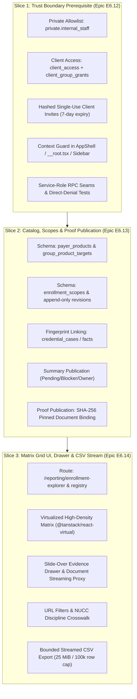

# WP1.1 (Transparent Enrollment Explorer) Agent Handoff & Orchestration Blueprint

**Document Version:** 1.0  
**Target Repository:** `/Users/ar/gemini/antigravity/scratch/mintedpanel`  
**Base Requirements Contract:** `docs/redesign/enrollment-explorer-wp1.1-requirements.md`  
**Current PR Base:** `ae7aff60cac28ee9e2ac5a7a30a8bb7bce6c5c3b`  
**Status:** Ready for Orchestration & Execution

---

## 1. Executive Mission & Orchestration Rules

You are tasked with executing the **3 sequential build slices** required to deliver **Work Package 1.1: Transparent Enrollment Explorer** (`/reporting/enrollment-explorer`).

### The Golden Rule: 1 Slice = 1 Bounded Epic = 1 Build PR
Do **not** attempt to build everything in one monolithic branch. Each slice must be executed, tested, and reviewed sequentially:
1. **Slice 1 (Epic E6.12):** Trust Boundary & Restricted Client Context (Auth, private tables, invite claim, route guard).
2. **Slice 2 (Epic E6.13):** Scoped Catalog, Enrollment Scopes & Proof Publication (Schema, revisions, source links, proof binding).
3. **Slice 3 (Epic E6.14):** Matrix Grid UI, Proof Drawer & Streamed CSV Export (Virtualization, filters, drawer, direct CSV stream).

---

## 2. Anti-Overkill Guardrails (What NOT to Build)

To prevent scope creep and over-engineering, adhere strictly to these hard boundaries:

| Area | DO BUILD | STRICTLY FORBIDDEN (OVERKILL) |
|---|---|---|
| **Client Auth & Access** | Service-only `client_access` + `client_group_grants`; hashed 7-day token claim. | ❌ Do NOT redesign application-wide RBAC.<br>❌ Do NOT write `memberships` rows for clients.<br>❌ Do NOT integrate email sending services (SendGrid/Resend) — generate link URL only.<br>❌ Do NOT touch existing internal staff workflows. |
| **Catalog & Products** | Curated `payer_products` table seeded manually by internal operators; `group_product_targets`. | ❌ Do NOT build AI/fuzzy product matching.<br>❌ Do NOT guess products from payer names or use wildcard products (`*`).<br>❌ Do NOT automatically materialize unresolved queues into complex background job engines. |
| **Cases & Historical Data** | Immutable `enrollment_scope_sources` links referencing `credential_cases` or `enrollment_facts`. | ❌ Do NOT modify the 4-part case key `(provider, group, payer, state)`.<br>❌ Do NOT modify `case_status_history` or write back to `credential_cases`.<br>❌ Do NOT auto-convert legacy cases into published scopes. |
| **Proof & Documents** | Append-only document version binding with SHA-256 checksum; authorized streaming proxy. | ❌ Do NOT build a general document signing/redaction editor.<br>❌ Do NOT generate public or persistent S3/GCS signed URLs.<br>❌ Do NOT build a multi-stage approval workflow engine (single admin review is sufficient). |
| **UI & Matrix** | High-density matrix using `@tanstack/react-virtual`; slide-over drawer; standard filters. | ❌ Do NOT introduce a new UI component library or styling system (use Geist tokens, `PageHeader`, `StatusPill`).<br>❌ Do NOT build BI charting, graphs, or interactive pivot wizards.<br>❌ Do NOT load all 3,000+ clinicians without keyset pagination (50 rows/page). |
| **CSV Export** | Synchronous streaming of authorized records (bounded at 100k rows / 25 MiB). | ❌ Do NOT build an asynchronous export queue, webhook system, or background worker.<br>❌ Do NOT build export history tables or persistent download folders.<br>❌ Do NOT integrate SFTP delivery drops (Wave 3 only). |
| **Financial / Billing** | Only enrollment status, effective dates, and next-action owners. | ❌ Do NOT touch claims, dollar amounts, or billing hold releases (WP1.2 / Wave 2). |

---

## 3. Slice-by-Slice Implementation Specifications



---

### SLICE 1: Trust Boundary & Restricted Client Context (Epic E6.12)

#### Objective
Establish verified audience context (`internal_staff` vs. `client`), private service-only access tables, atomic invite claim, and route denial gates before any UI or catalog work begins.

#### Exact Deliverables & Files
1. **Database Migration (`supabase/migrations/<timestamp>_client_access_context.sql`):**
   - Schema `private` (if not already present).
   - `private.internal_staff`: `(auth_user_id, org_id, staff_role, active)`. RLS denies `anon` & `authenticated`.
   - `public.client_access`: `(id, org_id, auth_user_id, created_at, updated_at)`.
   - `public.client_group_grants`: `(id, client_access_id, provider_group_id, created_at)`.
   - `public.client_invites`: `(id, org_id, email, token_hash, invited_by, expires_at, claimed_at, claimed_by_user_id)`.
   - RPCs:
     - `resolve_enrollment_context(p_actor_user_id UUID, p_org_id UUID)`: returns `{ role: 'staff' | 'client' | 'none', grantedGroupIds: UUID[] }`.
     - `claim_client_invite(p_token_hash TEXT, p_actor_user_id UUID)`: atomic claim verifying email equality, creating `client_access` & child grants.
     - Security: `SECURITY INVOKER`, revoke from `PUBLIC, anon, authenticated`, grant exclusively to `service_role`.
2. **Context & Server Layer:**
   - `src/services/clientAccess.ts`: Methods `resolveContext(actorId, orgId)` and `claimInvite(token, actorId)`.
   - `src/server/clientAccessRoutes.ts`: `/api/enrollment-explorer/context` and `/api/enrollment-explorer/claim-invite`. Derived from verified JWT (`authenticateUser(request).userId`).
   - `src/server/guard.ts`: Extend guard to support `client` audience restricted exclusively to `/reporting` and `/reporting/enrollment-explorer`.
3. **Frontend Shell Guarding:**
   - `src/routes/__root.tsx`: Mount audience resolver before rendering screens.
   - `src/components/layout/AppShell.tsx` & `src/components/layout/Sidebar.tsx`:
     - If audience is `client`: suppress global search and internal status/case hooks; restrict navigation to Reporting Center; do not render admin/settings links.
     - If audience is `staff`: retain full existing 6-link sidebar and standard behaviour.
4. **Testing Suite:**
   - `src/services/clientAccess.di.test.ts`: DI unit tests for invite claim, replay denial, expired token denial.
   - `e2e/enrollment-explorer-auth.spec.ts`: Verify scenarios **TS-163** (staff retains 6 links), **TS-164** (client restricted to granted groups), **TS-165** (invite claim & replay prevention), and **TS-166** (direct REST/RPC denial).

---

### SLICE 2: Scoped Catalog, Enrollment Scopes & Proof Publication (Epic E6.13)

#### Objective
Model true payer products, group targets, concrete 6-part scopes, append-only immutable revisions, source fingerprint binding, and proof publication.

#### Exact Deliverables & Files
1. **Database Migration (`supabase/migrations/<timestamp>_enrollment_explorer_scope_contract.sql`):**
   - `payer_products`: `(id, payer_id, product_key, name, active)`.
   - `group_product_targets`: `(id, org_id, group_id, payer_product_id, state, active)`.
   - `enrollment_scopes`: `(id, org_id, provider_id, group_id, payer_product_id, facility_id, state)`.
     - Unique constraint: `UNIQUE(org_id, provider_id, group_id, payer_product_id, facility_id, state)`. All fields `NOT NULL`.
   - `enrollment_scope_revisions`: `(id, scope_id, cycle_no, revision_no, status, intake_date, complete_to_submit_date, submitted_date, payer_acknowledged_date, effective_date, termination_date, payer_reference, retro_status, retro_days, retro_date, client_blocker, action_owner, created_at, created_by)`.
     - Immutable: no `UPDATE` trigger; only `INSERT`.
   - `enrollment_scope_sources`: `(id, revision_id, source_kind, source_id, source_fingerprint)`.
   - `enrollment_summary_publications`: `(id, revision_id, published_status, client_safe_blocker, action_owner, published_at, published_by)`.
   - `enrollment_proof_publications`: `(id, revision_id, document_version_id, evidence_kind, supported_fields, sha256_checksum, published_at, published_by)`.
   - `publication_events`: Append-only audit table logging `publish_summary`, `publish_proof`, and `revoke_publication`.
   - RPCs:
     - `save_enrollment_revision(...)`
     - `publish_enrollment_summary(...)`
     - `publish_enrollment_proof(...)`
     - `revoke_enrollment_publication(...)`
2. **Service & Engine Layer:**
   - `src/services/enrollmentExplorer.ts`: Fingerprint calculator over `credential_cases` and `enrollment_facts`. Unresolved queue query generator.
   - `src/services/enrollmentProof.ts`: SHA-256 verification and document version binding.
   - `src/server/enrollmentExplorerRoutes.ts` & `src/server/enrollmentProofRoutes.ts`: Dedicated endpoints for saving revisions, publishing summaries, and proxying proof downloads.
3. **Discipline Crosswalk:**
   - `src/lib/providerDiscipline.ts`: Pure crosswalk mapping `providers.taxonomy_code` to PT, PTA, OT, OTA, SLP, Other, Unknown based on the NUCC catalog.
4. **Testing Suite:**
   - `src/services/enrollmentExplorer.di.test.ts`: Test fingerprint recalculation, "Needs verification" on source mutation, rollback on cross-org scope creation.
   - `src/services/enrollmentProof.di.test.ts`: Verify SHA-256 mismatch rejection and revoked proof download denial.

---

### SLICE 3: Matrix Grid UI, Proof Drawer & Streamed CSV Export (Epic E6.14)

#### Objective
Build the client- and staff-facing high-density matrix, slide-over proof drawer, URL filters, and bounded direct-streaming CSV export.

#### Exact Deliverables & Files
1. **Report Registration & Routing:**
   - Update `src/lib/reports.ts`: Register `enrollment-explorer` under group `"credentialing"`.
   - Create `src/routes/reporting.enrollment-explorer.tsx`.
2. **Matrix Components:**
   - Install/verify dependency: `@tanstack/react-virtual` in `package.json`.
   - `src/components/reporting/EnrollmentExplorer.tsx`: Main container handling active filters, keyset pagination (50 rows/page), and drawer state.
   - `src/components/reporting/EnrollmentFilters.tsx`: Org, Group, State, Facility, Product, Discipline, Status, Search filters.
   - `src/components/reporting/EnrollmentMatrix.tsx`: Virtualized grid of Clinicians (rows) $\times$ Payer Products (columns).
     - Cell states: Approved/Verified (Green), In Progress/Pending (Blue/Yellow), Needs Verification (Warning), No Published Enrollment (Blank/Muted).
     - Multi-facility count badge if multiple locations exist for a cell.
3. **Slide-Over Detail Drawer (Proof Engine):**
   - `src/components/reporting/EnrollmentDrawer.tsx`:
     - Displays Status, Milestones (Intake $\to$ Submitted $\to$ Effective), Payer Reference #, Retro Window, Action Owner badge, and Client-safe Blocker.
     - Authorized proof download links via proof proxy (`/api/enrollment-explorer/proof/:id/download`).
4. **Streaming CSV Export Engine:**
   - `src/lib/enrollmentCsv.ts`: Deterministic formatter enforcing fixed column order, formula escaping, and UTF-8 encoding.
   - `src/services/enrollmentExport.ts`: Generates bounded database snapshot (enforcing maximum 100,000 rows and 25 MiB cap; returns 413 if exceeded).
   - `src/server/enrollmentExportRoutes.ts`: Streams response directly using standard `Response` stream with `Content-Disposition: attachment`.
5. **Testing Suite:**
   - `src/lib/enrollmentCsv.test.ts`: Formatting, escape characters, formula injection prevention (`=`, `@`, `+`, `-`).
   - `e2e/enrollment-explorer.spec.ts`: End-to-end matrix navigation, filtering, drawer slide-out, and proof download.
   - `e2e/enrollment-explorer-export.spec.ts`: Verify CSV streaming, header contracts, and 413 rejection when size limit is exceeded.

---

## 4. Exact Execution & Verification Protocol

For each slice, execute the following commands in order:

### Pre-Flight Verification
```bash
cd /Users/ar/gemini/antigravity/scratch/mintedpanel
git status
npm run lint:epics
```

### Build & Verification Commands
```bash
# 1. Type-checking
./node_modules/.bin/tsc --noEmit

# 2. Linting
npm run lint

# 3. Unit and Service Tests
npm run test

# 4. Production Application Build
npm run build

# 5. End-to-End Playwright Tests
npm run test:e2e
```

### Review & PR Gate
- Run `git diff origin/main...HEAD --stat` to verify only the approved file inventory was modified.
- Confirm no code changes touch `credential_cases`, `case_status_history`, or existing extension API routes.
- Confirm no unverified external dependencies were installed.
