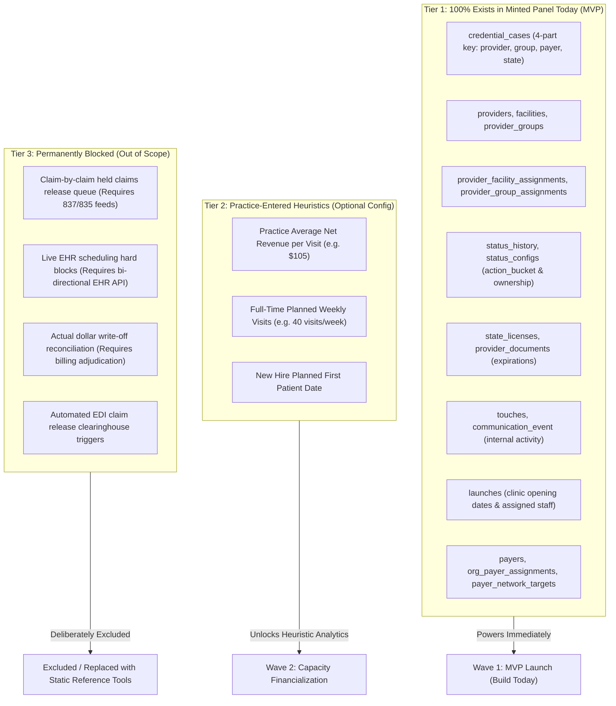
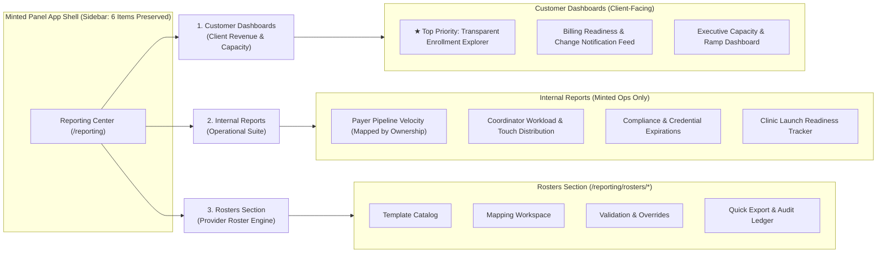
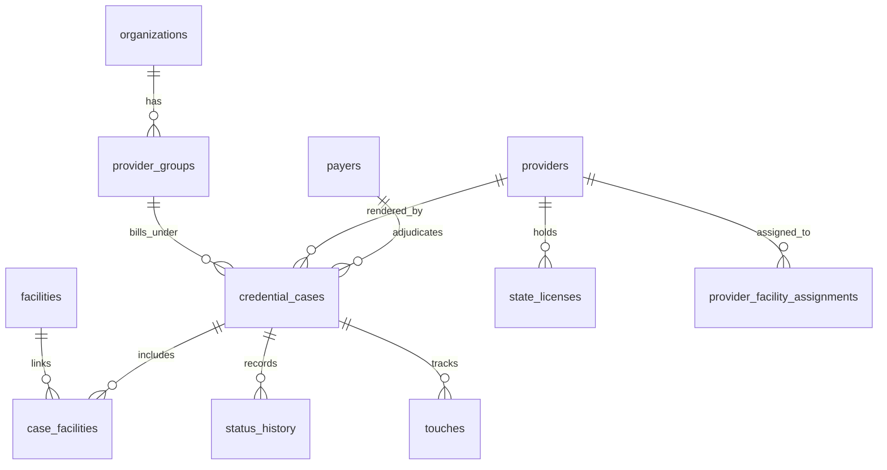
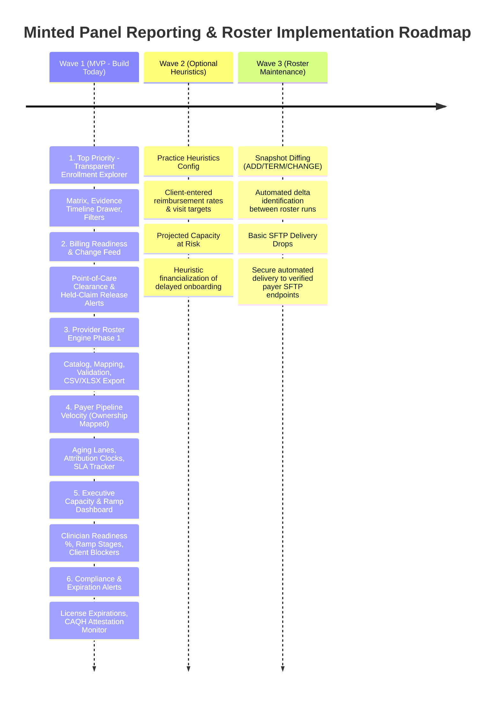

# Minted Panel Reporting & Roster Architecture Plan

**Document Status:** Architectural Blueprint & Decision Log (Pre-Build)  
**Version:** 2.1 (Incorporating PM Feedback: Billing Readiness Pivot, Ownership Mapping & Top-Priority Matrix)  
**Target Platform:** Minted Panel (TanStack Start, Supabase, Geist Design System)  

---

## 1. Executive Summary & Strategic Pivot

### 1.1 The Reality Check: No EHR, No Revenue Data
Traditional healthtech roadmaps often assume future integrations with Electronic Health Records (EHRs like WebPT, Prompt, Raintree) and clearinghouse billing engines (Waystar, Change Healthcare). 

**The Hard Architecture Boundary for Minted Panel:**
- **We will NEVER receive live revenue or claims data** (no 837 claim files, no 835 remittances, no claim-level allowed amounts, no billing hold reconcilers).
- **We will NEVER have direct EHR scheduling integrations** (no bi-directional calendar booking, no automated appointment locks, no real-time patient visit feeds).

### 1.2 The Reframed Positioning: Clinical Capacity & Billing Readiness
Rather than manufacturing fake financial metrics or unprovable "lost revenue" numbers that dissolve under CFO scrutiny, Minted Panel differentiates on **verifiable operational truth**:
1. **Transparent Enrollment Intelligence (Top Priority):** Delivering a high-density, searchable matrix of every clinician $\times$ payer product $\times$ location with primary source evidence, timestamps, and active status.
2. **Billing Readiness & Change Notifications:** In outpatient therapy, clinics regularly **hold claims until a provider is credentialed**. Minted Panel serves as the authoritative clearance signal and notification feed to alert the billing team the moment new enrollments are approved, effective dates are confirmed, and held claims can be safely submitted.
3. **Payer Pipeline Velocity with Ownership Mapping:** Tracking application aging by explicit **Action Owner** (*Minted Panel* vs. *Client/Provider* vs. *Payer*), eliminating ambiguity over whose turn it is to act.
4. **Accurate, Payer-Compliant Rostering:** Delivering automated, validated, pixel-perfect roster spreadsheets to payers without manual double-entry.

---

## 2. Data Readiness & Blockage Classification

Every reporting capability is categorized strictly by its data prerequisite:



### Data Inventory Matrix

| Feature Concept | Data Dependency | Current Status | Architecture Verdict |
|---|---|---|---|
| **Transparent Enrollment Explorer** | `credential_cases`, `facilities`, `payers`, `status_history` | **Available Today** in Supabase | **TOP PRIORITY #1 (MVP)** — Build first |
| **Billing Readiness & Change Feed** | Case status, effective date, retro window, facility links, licenses | **Available Today** in Supabase | **High Priority (MVP)** — Essential for billing held claims |
| **Payer Pipeline Velocity (Ownership Mapped)** | `status_history`, `status_configs.action_bucket`, `touches` | **Available Today** in Supabase | **Core MVP (Phase 1)** — Build immediately |
| **Payer Roster Engine (Phase 1)** | Provider demographics, NPI, licenses, facility addresses, TINs | **Available Today** in Supabase | **Core MVP (Phase 1)** — Build immediately |
| **New Hire Ramp Tracker** | Case creation date, milestone dates, launch dates | **Available Today** in Supabase | **Core MVP (Phase 1)** — Track days & stages |
| **Actionable Blockers Deck** | Missing documents, unsigned forms, CAQH attestation | **Available Today** in Supabase | **Core MVP (Phase 1)** — Client task alerts |
| **Expiring Credentials Alert** | `state_licenses.expiration_date`, documents | **Available Today** in Supabase | **Core MVP (Phase 1)** — Compliance tool |
| **Capacity at Risk (\$ Projection)** | Practice visit targets + avg reimbursement | **Requires User Input** | **Wave 2** — Optional client-configured multiplier |
| **Claim-by-Claim Held Queue** | Claim IDs, service dates, expected allowed \$ | **Permanently Missing** (No billing) | **DEPRECATED / EXCLUDED** |
| **Live EHR Scheduling Blocks** | Real-time EHR appointment calendar | **Permanently Missing** (No EHR API) | **REPLACED** by Billing Readiness Tool |

---

## 3. The Three-Pillar Architecture (MVP Scoped)



---

### Pillar A: Customer Dashboards (Client Capacity & Billing Suite)
*Target Audience: Client Practice Managers, Billing Leads, Clinic Directors, CEOs, CFOs.*

#### 1. ★ TOP PRIORITY: Transparent Enrollment Explorer
- **The Core Value:** Serves as the authoritative, self-service lookup matrix across the client organization. Practice managers and billing staff can answer *"What is the status of my clinicians, what is waiting, and what is the proof?"* in seconds without sending emails.
- **Matrix Layout:**
  - High-density grid: Clinicians (rows) $\times$ Payer Products (columns).
  - Multi-level filtering: Active Organization, Specific Facility/Clinic, Provider Discipline (PT, PTA, OT, OTA, SLP), and Case Status.
  - Performance: Virtualized rendering (`@tanstack/react-virtual`) supporting 3,000+ clinicians with zero frame drops.
- **Slide-Over Detail Drawer (The Proof Engine):**
  - Clicking any cell opens a persistent detail drawer with primary source verification:
    - **Current Status:** Color-coded `StatusPill` and Action Owner badge.
    - **Key Milestones:** Intake Date, Complete-to-Submit Date, Submission Date, Payer Acknowledged Date, and Effective Date.
    - **Payer Reference #:** Payer-assigned tracking/case ID.
    - **Effective Date & Retro Window:** Documented contract effective date and eligible retrospective billing days (if supported by payer).
    - **Outstanding Dependency:** Explicit blocker reason (e.g., *"Awaiting clinician signature on CAQH attestation"*).
    - **Next Action Owner:** Clearly assigned to *Client*, *Minted Panel*, or *Payer*.
    - **Audit Evidence Link:** Downloadable link to approved payer letter, roster confirmation, or state PSV license verification.
- **Export:** Role-scoped CSV export preserving all filtered cell attributes.

#### 2. Billing Readiness & Credentialing Change Feed
- **The Clinic Reality:** Outpatient therapy practices intentionally **hold claims in their billing software** until a clinician is credentialed or retro-effective. Releasing claims too early causes costly denials; releasing them too late causes timely-filing expirations.
- **The Solution:** Minted Panel acts as the authoritative billing clearance signal and real-time notification engine.
- **Two Core Modes:**
  1. **Point-of-Care Billing Clearance Lookup:**
     - Query by **Clinician + Facility + Payer Product**.
     - Evaluates the 4-part key against approved cases, active facility assignments, verified state licenses, and PTA/OTA supervisory linkage.
     - **Clearance Verdicts:**
       - **GREEN (Billable Ready):** Provider is active and linked. Displays verified Effective Date and Retroactive Billing Window. Safe to release held claims.
       - **YELLOW (Hold Claims / Pending):** Case is submitted or in review. Displays estimated decision window and instructs billing to continue holding claims.
       - **RED (Do Not Bill / Out-of-Network):** Case is denied, uncontracted, or license is expired. Route to self-pay or reschedule.
     - **Therapy Modifier Guidance:** If provider is a PTA or OTA, checks for active supervising PT/OT linkage at that facility and reminds billing to append the `CQ` or `CO` modifier.
  2. **Billing Change Notification Feed & Alerts:**
     - A dedicated, filterable change log alerting the billing team to recent credentialing events:
       - *Newly Approved Providers* (with effective dates).
       - *Location Linkage Additions* (provider now authorized at Facility B).
       - *Terminations & License Expirations* (immediate warning to stop billing).
     - Automated weekly/daily billing digest email/export summarizing all newly billable combinations so billing leads can batch-release held claims in WebPT/Prompt/Raintree.

#### 3. Executive Clinician Readiness & Deployment Dashboard
- **Target Audience:** CEO, CFO, Regional VPs.
- **Headline Metrics:**
  - *Ready-to-Deploy Clinicians:* Distinct count and % of active clinicians with $\ge 1$ verified billing combination.
  - *New Hires in Onboarding:* Count of clinicians within their first 90 days.
  - *Stalled Enrollments:* Enrollments aging beyond historical payer norms.
  - *Actionable Client Blockers:* Outstanding signatures, missing CAQH attestations, or missing licenses.
- **New Hire Ramp Timeline:** Cohort visualization (Intake $\to$ CAQH Verified $\to$ Submitted $\to$ Payer Acknowledged $\to$ Approved $\to$ Location Linked).
- **Financial Translation (Wave 2 Config):** If practice admin inputs an estimated average reimbursement per visit (e.g., \$100) and expected visits per week (e.g., 35), the dashboard calculates **Projected Clinical Capacity Delayed**, clearly labeled as an assumption-based heuristic.

---

### Pillar B: Internal Reports (Operational Suite)
*Target Audience: Minted Panel Credentialing Managers, Coordinators, Ops Leads. Strictly internal; invisible to client roles.*

#### 1. Payer Pipeline Velocity & SLA Tracker (Status-to-Ownership Mapping)
- **Status Mapping by Ownership:**
  Every status in `status_configs` and `credential_cases` is strictly mapped to an **Action Owner** using Minted Panel's `ActionBucket` model:
  
  ```
  ActionBucket Closed Set:
    ├── "ours"             -> Minted Panel Operational Ownership
    ├── "waiting_provider" -> Client / Clinician Ownership
    ├── "waiting_payer"    -> Payer Processing Ownership
    └── "complete"         -> Terminal / Verified State
  ```

  | Canonical Status | Color | Action Bucket | Mapped Action Owner | Operational SLA / Trigger |
  |---|---|---|---|---|
  | **Not Started** | `#9CA3AF` | `ours` | Minted Panel | Complete intake within 2 business days |
  | **In Progress** | `#2563EB` | `ours` | Minted Panel | Application prep & document packaging |
  | **Waiting on Provider** | `#D97706` | `waiting_provider` | Client / Clinician | Awaiting clinician signature, CAQH, or license |
  | **Submitted** | `#0891B2` | `waiting_payer` | Payer | Awaiting payer receipt acknowledgment (5 days) |
  | **Payer Processing** | `#6366F1` | `waiting_payer` | Payer | Under payer review (tracked against payer SLA) |
  | **In Network / Approved** | `#059669` | `complete` | Complete | Enrollment verified; triggers Billing Notification |
  | **Denied / Out of Network**| `#DC2626` | `complete` | Complete | Terminal denial; requires RFI or appeal |

- **Operational Features:**
  - Multi-lane Kanban / aging table groupable by **Action Owner** or **Payer $\times$ State**.
  - **Attribution Clocks:** Separates *Days with Payer* from *Days Waiting on Client* from *Days with Minted Panel*, ensuring accountability.
  - **Payer Follow-up Queue:** Surfaces cases exceeding payer-specific follow-up cadences.

#### 2. Credentialer Work Queues & Touch Distribution
- Case assignment volume per coordinator.
- Communication touches per week (`touches` table).
- Bottleneck detector (cases stuck in one stage $> 14$ days).

#### 3. Source Re-verification & Compliance Monitor
- Expiration countdown for `state_licenses` (30/60/90 days).
- CAQH Re-attestation alerts (120-day standard, 180-day Illinois rule).
- Malpractice COI and board certification expiration tracker.

#### 4. Clinic Launch Coverage Report
- Cross-references upcoming clinic openings (`launches` table) against required provider-payer enrollments to prevent unstaffed/unbillable new site openings.

---

### Pillar C: Rosters Section (Provider Roster Engine)
*Target Audience: Credentialing Managers and Operations Staff generating external payer submissions.*
*Location: Accessible via `Reporting Center → Roster Engine` (`/reporting/rosters/*`).*

1. **Template Catalog:** Payer-specific schema definitions (e.g., BCBS NC Roster, Humana Roster, UHC Multi-Location Roster).
2. **Mapping Workspace:** Visual column mapper connecting payer schema fields to Minted Panel tables (`providers`, `facilities`, `provider_groups`, `state_licenses`). Includes deterministic transforms (uppercase, date format `YYYY-MM-DD` vs `MM/DD/YYYY`, NPI check).
3. **Validation & Overrides:** Automated validation checks (NPI Luhn/format, taxonomy codes, active license verification, missing mandatory address lines). Hard errors prevent export unless overridden with a recorded $\ge 20$-character audit reason.
4. **Quick Export & Audit Ledger:** One-click generation of exact CSV or XLSX spreadsheets. Automatically generates an immutable database snapshot record with a `sha256` checksum for auditability.

---

## 4. Canonical Data Model & The 4-Part Key

Minted Panel's existing database architecture already contains the exact grain needed for billable readiness.

### 4.1 The 4-Part Grain in Supabase
In migration `20260713150000_case_key_4part.sql`, Minted Panel established the canonical uniqueness rule for `credential_cases`:
```sql
UNIQUE NULLS NOT DISTINCT (provider_id, group_id, payer_id, state)
```
Combined with `case_facilities` and `provider_facility_assignments`, readiness is derived deterministically:

```
Readiness State = 
  f(credential_cases.status, 
    provider_facility_assignments.is_active, 
    state_licenses.is_valid, 
    payer_network_targets.is_active)
```



---

## 5. Decisions Log (Updated)

| ID | Topic | Decision | Justification |
|---|---|---|---|
| **DEC-01** | Primary Navigation | **Preserve exactly 6 sidebar items.** Roster Engine lives inside `Reporting Center` (`/reporting/rosters/*`). | Preserves core IA and keeps the left rail uncluttered. |
| **DEC-02** | Design Tokens & Shell | **Reuse existing Minted Panel primitives.** Geist fonts, `#0C2A1D` forest sidebar, white card panels, 4px/6px radii, `StatusPill`. | Eliminates design drift and speeds up development. |
| **DEC-03** | Priority Order | **Transparent Enrollment Explorer is Report #1 (Top Priority).** | Delivers immediate, high-density visibility for both client leaders and internal operations. |
| **DEC-04** | Billing Alignment | **Reframe clearance as Billing Readiness & Change Feed.** | Aligns with clinic practice of holding claims until credentialed; provides billing with an unambiguous signal to release claims. |
| **DEC-05** | Status Ownership | **Map all statuses to Action Owners.** | Uses `ActionBucket` (`ours`, `waiting_provider`, `waiting_payer`, `complete`) to establish clear accountability. |
| **DEC-06** | Financial Scope | **Deprecate all held-claim and claim-level revenue features.** | Minted Panel will not have 837/835 billing feeds; presenting fake revenue figures destroys trust. |
| **DEC-07** | Revenue Estimation | **Wave 2 heuristic multiplier only.** If a client desires financial metrics, apply practice-configured average visit rates to delayed capacity days. | Keeps financial modeling transparent, assumption-based, and auditable. |
| **DEC-08** | Roster Engine Grains | **Support four grains:** Provider, Provider-Location, Provider-Location-TIN, Provider-Plan/Network. | Accurately models the exact spreadsheet structures required by commercial payers and Medicare MACs. |
| **DEC-09** | Snapshot Immutability | **Immutable database snapshots with sha256 checksums.** | Guarantees exact historical reproducibility if a payer claims a provider was omitted from a roster. |

---

## 6. Phased Implementation Roadmap (Reprioritized)

The roadmap is phased strictly by **data readiness** and **user priority**:



---

### Wave 1: The Zero-External-Dependency MVP (Ready to Build Today)

#### Work Package 1.1: ★ TOP PRIORITY — Transparent Enrollment Explorer
- **User Story:** As a practice manager, billing lead, or client executive, I want a single, interactive matrix of all our clinicians across payers and locations so I can see our exact network status, review verified proof, and identify who owns the next action.
- **Data Source:** Existing `credential_cases`, `facilities`, `payers`, `status_history`.
- **Deliverables:**
  - Route: `/reporting/enrollment-explorer`.
  - High-density matrix of Clinician $\times$ Payer Product, filtered by Active Organization and Facility.
  - Slide-over detail drawer showing submitted date, payer reference #, effective date, retroactive window, and next-action owner.
  - Downloadable proof document links.
  - Client-facing CSV export.

#### Work Package 1.2: Billing Readiness & Credentialing Change Feed
- **User Story:** As a billing specialist holding claims for new clinicians, I want a fast verification tool and an ongoing change feed so I know the exact day a provider is approved and can safely release held claims without receiving denials.
- **Data Source:** Existing `credential_cases`, `provider_facility_assignments`, `state_licenses`, `providers`.
- **Deliverables:**
  - Route: `/reporting/billing-readiness`.
  - **Mode 1 (Lookup):** Fast search by Clinician + Facility + Payer. Returns Green (Billable Ready with Effective Date), Yellow (Hold Claims / Pending), Red (Do Not Bill).
  - **Mode 2 (Change Notification Feed):** Chronological feed of newly approved enrollments, location linkage additions, and license changes.
  - Exportable / emailable "Newly Billable" digest for billing batch runs.
  - PTA/OTA supervisory linkage check with `CQ`/`CO` modifier alerts.

#### Work Package 1.3: Provider Roster Engine (Phase 1)
- **User Story:** As a credentialing coordinator, I want to map our provider and location data to payer-specific roster templates and export validated spreadsheets so payers accept our submissions without format rejections.
- **Data Source:** Existing `providers`, `facilities`, `provider_groups`, `state_licenses`, `credential_cases`.
- **Deliverables:**
  - Route: `/reporting/rosters/templates` — Template catalog (pre-loaded with BCBS NC, Humana, Medicare MAC templates).
  - Route: `/reporting/rosters/mapping/:id` — Table-first mapping editor with persistent column inspector.
  - Route: `/reporting/rosters/validation/:id` — Rule validation engine (NPI check, license check, required fields) with $\ge 20$-character override logging.
  - Route: `/reporting/rosters/export/:id` — Deterministic CSV & XLSX generator with immutable snapshot storage and sha256 checksums.
  - Route: `/reporting/rosters/history` — Historical export log with download access controls.

#### Work Package 1.4: Payer Pipeline Velocity & SLA Tracker (Ownership Mapped)
- **User Story:** As a credentialing manager or ops lead, I want to track case turnaround by Payer, State, and Action Owner so I can see which cases are aging and whether the delay is on our team, the client, or the payer.
- **Data Source:** Existing `status_history`, `status_configs.action_bucket`, `credential_cases`, `touches`.
- **Deliverables:**
  - Route: `/reporting/pipeline-velocity` (P1/internal staff only).
  - Multi-lane Kanban aging table grouped by Action Owner (*Ours*, *Waiting on Client/Provider*, *Waiting on Payer*).
  - Attribution clocks: *Days with Payer* vs. *Days Waiting on Client* vs. *Days with Minted Panel*.
  - Overdue Payer Follow-up Queue based on `touches` cadence.

#### Work Package 1.5: Executive Capacity & Ramp Dashboard
- **User Story:** As a CEO or CFO, I want a high-level view of our clinician deployment capacity and onboarding ramp so I know where hiring capacity is stalled without wading into casework queues.
- **Data Source:** Existing `credential_cases`, `providers`, `launches`, `status_history`.
- **Deliverables:**
  - Route: `/reporting/capacity-ramp`.
  - KPI Strip: Clinicians Ready to Bill %, New Hires in Onboarding, Stalled Enrollments, Actionable Client Blockers.
  - New Hire Cohort Ramp: Visual stage-progression curves tracking days from intake to billable readiness.
  - Actionable Blocker Deck: Explicit list of client-owned dependencies ("Awaiting Clinician Signature", "Missing Malpractice Insurance", "CAQH Attestation Due").

#### Work Package 1.6: Compliance & Expiration Alerts
- **User Source:** Existing `state_licenses`, `provider_documents`.
- **Deliverables:**
  - Route: `/reporting/expiring-credentials` (Hardening of existing registered report).
  - Automated 30/60/90-day countdowns for licenses, malpractice insurance, and CAQH re-attestations.

---

### Wave 2: Optional Practice-Configured Financialization
*Prerequisite: Client admin enters practice-level operating assumptions.*

- **Deliverables:**
  - Organization settings tab: Input **Estimated Net Reimbursement per Visit** (default: \$100) and **Target Weekly Visits per Full-Time Clinician** (default: 40).
  - Executive Dashboard toggle: **"Display Projected Capacity at Risk"**.
  - Formula: $\text{Delayed Clinician Days} \times \frac{\text{Target Visits}}{5} \times \text{Avg Net Reimbursement}$.
  - Explicit disclaimer: *"Assumption-based operational capacity model; does not represent actual claims or accounts receivable."*

---

### Wave 3: Advanced Roster Maintenance (Post-MVP)
*Prerequisite: Operational validation of Wave 1 manual exports.*

- **Deliverables:**
  - Automated Delta Comparison: Engine compares Snapshot $N$ vs. Snapshot $N-1$ to generate ADD, TERM, and CHANGE flags.
  - Basic SFTP Delivery: Automated upload of verified snapshot files to configured payer SFTP servers.
  - Delivery Receipt Ledger: Log of transmission timestamps, response codes, and confirmation records.

---

## 7. Immediate Next Steps & Implementation Checkpoints

1. **Registry Integration:** Add the approved MVP reports into `src/lib/reports.ts` and `src/routes/reporting.index.tsx` under the established groups (*Performance, Credentialing, Compliance, Intake*) plus the new *Roster Engine* group.
2. **Component Reuse:** Ensure all new pages utilize `PageHeader`, `AppShell`, `StatusPill`, and the table density tokens defined in `src/styles/tokens.css`.
3. **Tenant Security:** Verify PostgreSQL Row-Level Security (RLS) on all queries to prevent cross-organization data leakage.
